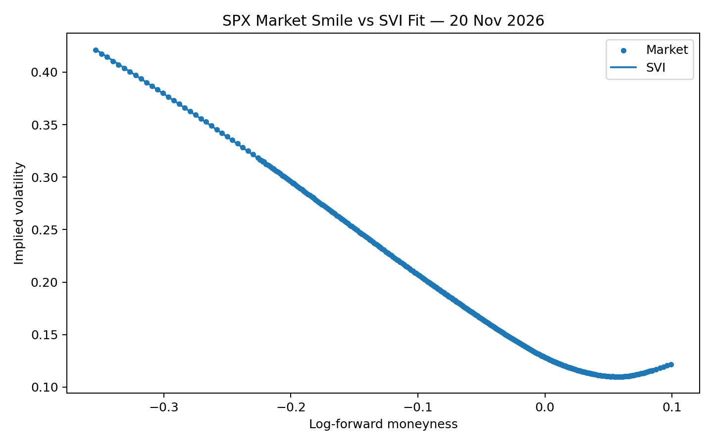
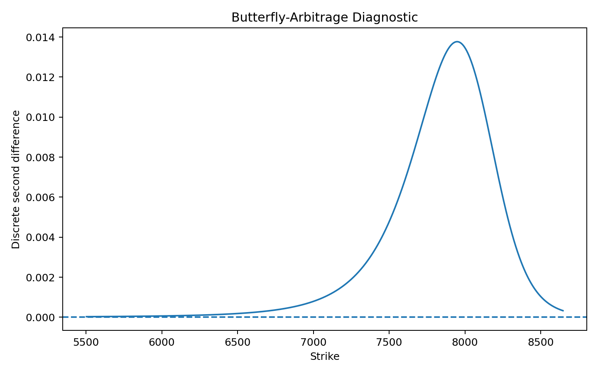

# SPX Volatility Calibration

A compact derivatives-quant research project that reconstructs an SPX implied-volatility smile from raw option bid/ask quotes, estimates the forward and discount factor from put-call parity, calibrates a raw-SVI smile, and checks numerical static-arbitrage conditions.

## What the project does

For a single SPX maturity, the pipeline is:

1. Clean a raw Cboe option-chain snapshot.
2. Estimate the forward price `F` and discount factor `D(T)` from

   `C(K,T) - P(K,T) = D(T) [F(T) - K]`.

3. Select OTM puts below the forward and OTM calls above it.
4. Recover Black implied volatilities numerically from bid/ask mid-prices.
5. Convert strikes to log-forward moneyness

   `k = log(K/F)`

   and implied vols to total variance

   `w(k,T) = sigma_imp(k,T)^2 T`.

6. Calibrate raw SVI

   `w(k) = a + b [rho (k-m) + sqrt((k-m)^2 + sigma^2)]`.

7. Reconstruct call prices from the fitted smile and check, on a dense grid over the observed strike range,

   `dC/dK <= 0` and `d^2C/dK^2 >= 0`.

## Snapshot used for the current results

- SPX quote date: **7 October 2026**
- expiry: **20 November 2026**
- initial option-chain strikes: **485**
- forward estimate: approximately **7833.69**
- discount factor estimate: approximately **0.99466**
- retained OTM quotes after filtering: **389**
- implied-volatility RMSE of SVI fit: approximately **3.7 vol bps**
- monotonicity violations detected on the tested grid: **0**
- butterfly-convexity violations detected on the tested grid: **0**

These are numerical diagnostics over the observed calibration range, not a proof of global arbitrage-freeness for all strikes.

## Results

### Market smile and SVI fit



### Numerical butterfly-arbitrage diagnostic



## Repository structure

```text
spx-volatility-calibration/
├── data/
│   ├── README.md
│   └── raw/
├── notebooks/
│   └── analysis.ipynb
├── outputs/
│   ├── implied_vol_smile.png
│   ├── svi_fit.png
│   └── arbitrage_diagnostic.png
├── src/
│   ├── arbitrage.py
│   ├── black.py
│   ├── data.py
│   ├── forward.py
│   ├── implied_vol.py
│   ├── smile.py
│   └── svi.py
├── .gitignore
├── README.md
└── requirements.txt
```

## Running the analysis

Install the dependencies:

```bash
pip install -r requirements.txt
```

Download a delayed SPX option-chain CSV manually from Cboe and place it at:

```text
data/raw/spx_quotedata.csv
```

Then open:

```text
notebooks/analysis.ipynb
```

The raw market-data CSV is not committed to the public repository.

## Current scope and extensions

Version 1 deliberately focuses on one maturity so that the calibration and no-arbitrage logic remain transparent and defensible.

Planned extensions include multiple expiries, a full volatility surface, calendar-arbitrage diagnostics, SSVI, Dupire local volatility, and comparison with stochastic-volatility models such as Heston.
